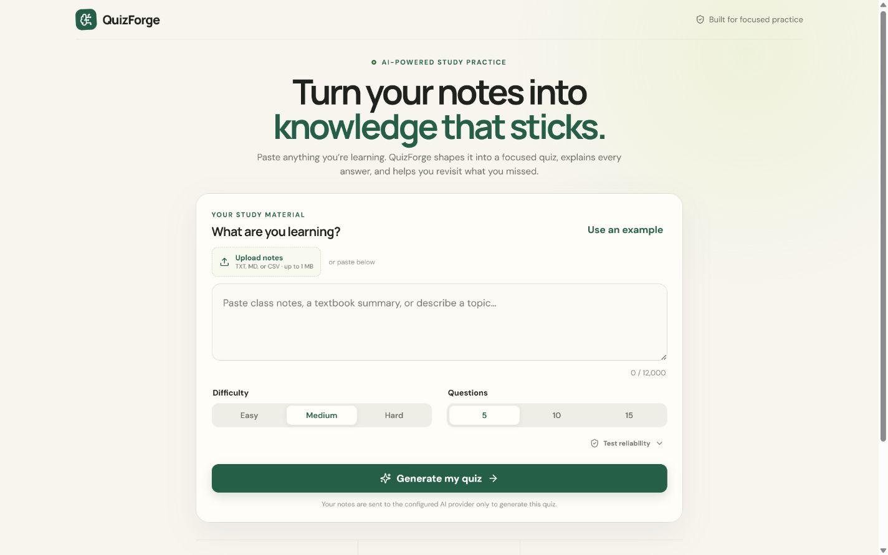
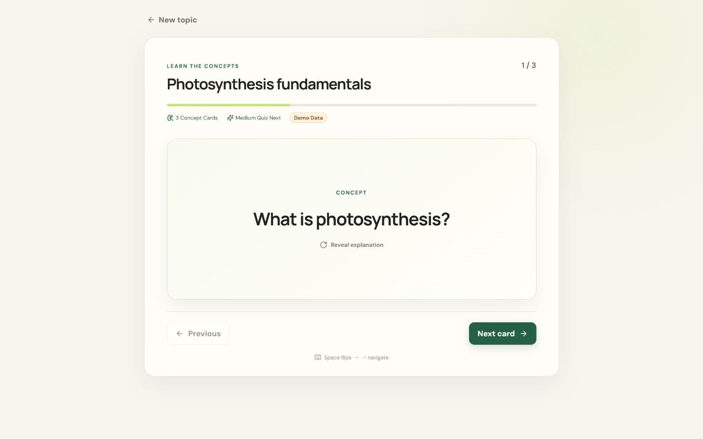
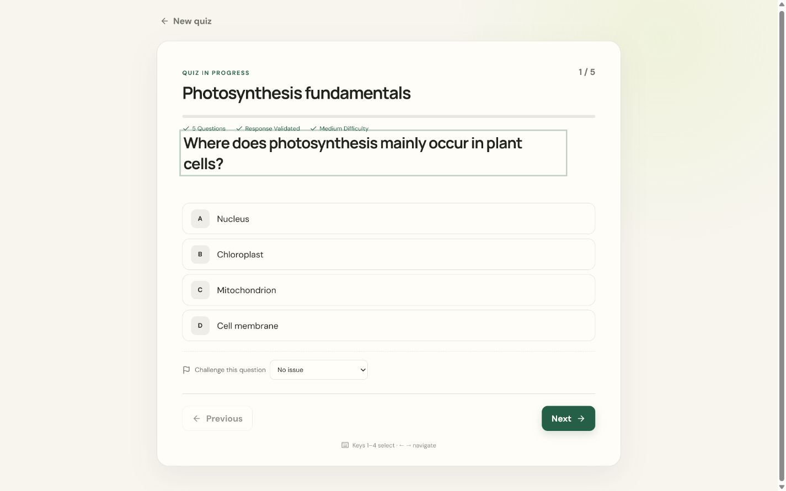
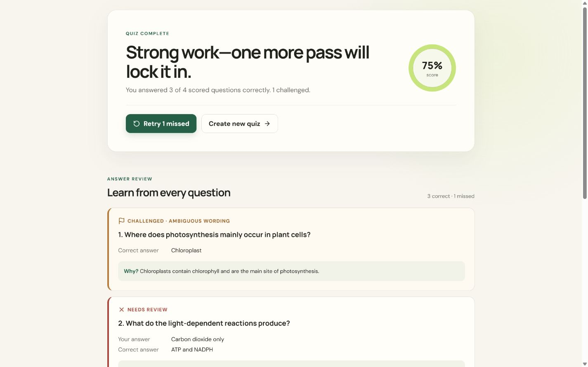
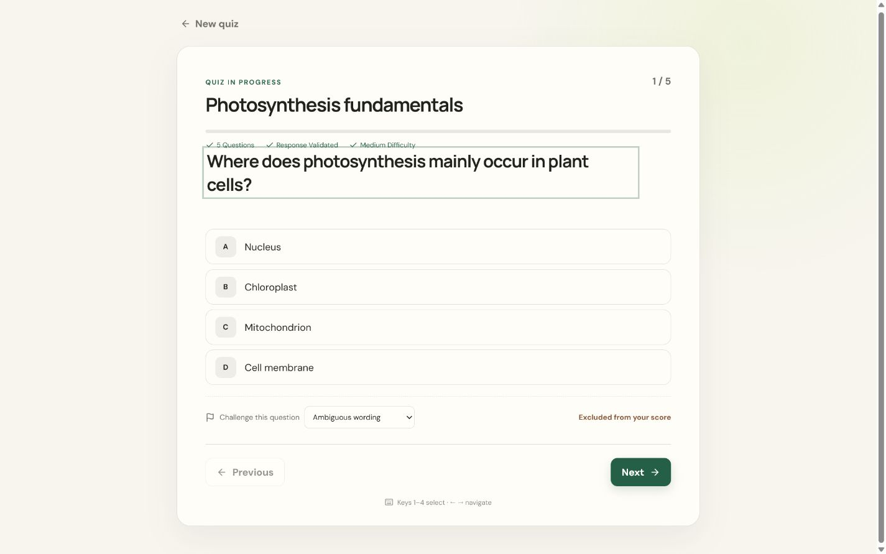
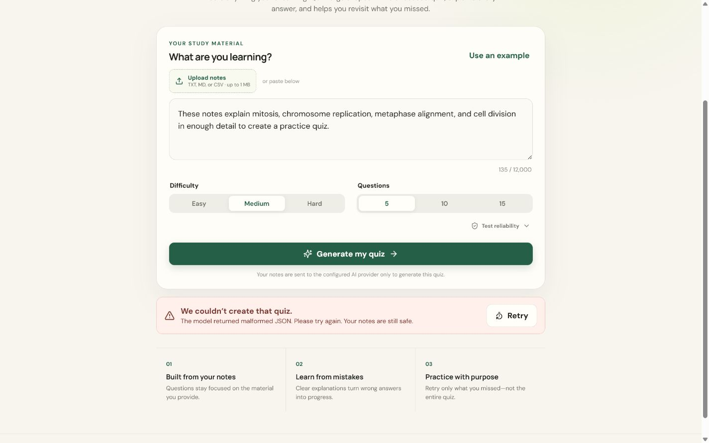

# QuizForge

QuizForge turns free-form study notes into validated flashcards and an interactive multiple-choice quiz. It is built around the less glamorous—but most important—part of an AI feature: treating model output as untrusted data and failing without losing the user's work.



## Product tour

### Learn concepts before testing recall



| Interactive quiz | Results and explanations |
| --- | --- |
|  |  |

| Question challenge | Failure recovery | Mobile layout |
| --- | --- | --- |
|  |  |  |

## Features

- Real Gemini integration through a server-only API route
- Strict Zod validation on both request and response boundaries
- Interactive quiz navigation, scoring, explanations, and retry-only-missed flow
- AI-generated concept flashcards with flip, keyboard navigation, and a learn-before-quiz flow
- Independent flashcard and question counts with an enforced 20-item reliability budget
- Challenge questionable AI output and exclude it transparently from scoring
- Validated local session recovery and keyboard shortcuts (`1–4`, arrow keys)
- Development-only failure simulator for malformed, empty, timed-out, and failed responses
- Visible generation summary showing question count, difficulty, and validation status
- Explicit loading, slow, empty, validation, network, timeout, rate-limit, and provider-error states
- `AbortController` plus monotonically increasing request IDs so stale responses cannot win
- Bounded Gemini retries and an optional schema-validated OpenRouter fallback
- Responsive, keyboard-accessible interface with visible focus and screen-reader status messages
- Opt-in mock mode for evaluators without an API key
- Automated tests for invalid AI shapes, malformed JSON, scoring, and retries

## Run locally

Requires Node.js 20 or newer.

```bash
npm install
cp .env.example .env
npm start
```

Open [http://localhost:3000](http://localhost:3000).

Add a Gemini API key to `.env` for real generation:

```env
GEMINI_API_KEY=your_key_here
GEMINI_MODEL=gemini-3-flash-preview
```

An optional OpenRouter fallback can keep generation available during temporary Gemini outages:

```env
OPENROUTER_API_KEY=your_key_here
OPENROUTER_MODEL=google/gemma-4-26b-a4b-it:free
AI_FALLBACK_ENABLED=true
```

Gemini remains the primary provider. OpenRouter is called only after retryable Gemini failures such as `429` or `5xx`. Its response passes through the same parser and Zod schema, and the UI discloses when the backup provider was used.

To evaluate the complete UI without a key, set `MOCK_AI=true`. Mock mode is explicitly labelled and never silently replaces an unsuccessful model call.

## Commands

```bash
npm start       # client and API development server
npm run build   # type-check and create the production bundle
npm test        # run the test suite once
npm run dev     # start with server file watching
npm run lint    # run ESLint
```

## Deploy on Render

The included `render.yaml` defines the web service, build command, health check, production environment, and Gemini model. Connect the repository to Render using **New → Blueprint**, then provide `GEMINI_API_KEY` in the Render dashboard. The key is marked `sync: false` and is never stored in the repository.

After deployment, add the public URL near the top of this README and test one real generation from the deployed application.

## Demo and interview

The [interview guide](docs/INTERVIEW_GUIDE.md) contains a 90-second recording script, architecture diagram, explanations for the main reliability decisions, and likely live-coding changes.

During local development, `/?preview=flashcards` opens a deterministic flashcard screen for visual QA and screenshots. This preview is guarded by Vite's development flag and is not available in production builds.

## Architecture and reliability

The browser posts notes and study-set settings to `POST /api/generate-quiz`. The Express server validates the request, asks Gemini for concept flashcards and quiz questions in one JSON-schema response, enforces a 90-second timeout, safely removes an optional JSON code fence, parses the response, validates it with Zod, and verifies the requested item counts. The React UI only receives trusted study data.

The parser performs only mechanically safe normalization: regenerating display IDs, converting an integer index encoded as a string, and deduplicating text-identical options while remapping the same correct answer. It never invents an answer or guesses an out-of-range index. Malformed, empty, count-mismatched, or structurally invalid responses become retryable errors.

On the client, starting a request aborts the previous fetch. Every request also receives an increasing local ID; state is updated only if the completed request is still the newest. The ID check provides protection even if a transport or test double ignores abort signals.

The notes are marked as untrusted study material in the system prompt, and the model is instructed not to follow embedded instructions. API keys never reach the browser. Model text is rendered as normal React text, not HTML.

## Testing failure cases

The test suite covers malformed JSON, empty responses, incorrect answer indexes, duplicate options and IDs, safe normalization, exact item counts, stale-response protection, session recovery, scoring, and creation of a retry quiz without mutating the original.

For a manual timeout check, use browser network throttling or pause the API request and confirm the slow-state copy appears after six seconds. Starting another generation cancels the previous request; late responses are ignored.

## AI usage note

I used OpenAI Codex to help plan and implement the initial architecture, failure cases, UI, and test coverage. The code is intentionally kept direct and documented so every reliability decision can be reviewed and explained during an interview. All generated work should be manually reviewed and understood before submission.

## Known limitations

- Model-generated questions can still contain factual mistakes despite structural validation.
- Input is limited to 12,000 characters, each content type is limited to 15 items, and the combined study set is capped at 20 items for reliable free-provider generation.
- Progress persists in the current browser only; it does not sync across browsers or devices.
- Rate limits and availability depend on the configured Gemini account and model.
- OpenRouter free-model latency and availability can vary; the UI exposes slow and retry states.
- The mock fixture is based on photosynthesis and is intended only for interface evaluation.

## Time spent

Approximately 8 hours, including product planning, frontend implementation, AI integration, responsive styling, reliability tests, and documentation.

## Next steps

With more time, I would add cross-device session sync, PDF extraction, and provider telemetry that does not expose note contents. Streaming is deliberately deferred because partially streamed JSON increases complexity without improving the assignment's core reliability goals.
