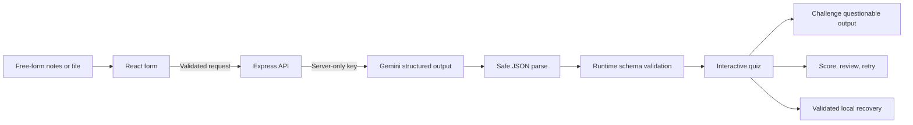

# QuizForge interview guide

## 90-second demo script

1. **0–10s — Problem:** “QuizForge turns unstructured notes into validated, interactive practice—not a chatbot.”
2. **10–25s — Input:** Upload a `.txt` note file, choose difficulty, and generate with real Gemini.
3. **25–35s — Learn:** Flip an AI-generated concept card and move into the quiz.
4. **35–50s — Interaction:** Answer with keys `1–4`, navigate with arrows, and challenge one ambiguous question.
5. **50–65s — Results:** Show explanations, adjusted scoring, and retry only missed questions.
6. **65–75s — Recovery:** Refresh and continue the locally saved session.
7. **75–90s — Reliability:** Open **Test reliability**, simulate malformed output, and show that the notes remain available with a retry action.

Record once at desktop width and briefly resize to a phone viewport. Do not expose the API key or `.env` file.

## Architecture

## Interview answers

### Why validate structured output?

JSON mode influences the model but does not protect against empty responses, truncated transport, provider regressions, or semantically invalid indexes. Zod creates a runtime trust boundary before React renders anything.

### How are stale responses prevented?

Each generation increments a local request ID and aborts the previous fetch. A response updates state only when its ID is still current. The ID guard remains effective even if a transport or test double ignores abort signals.

### Why exclude challenged questions?

A response can be structurally valid but factually wrong or ambiguous. Penalizing the learner would be misleading, so challenged questions are transparently removed from both the numerator and denominator and omitted from the retry queue.

### Why is the API key on the backend?

Browser bundles and network requests are inspectable. The Express boundary keeps credentials private, centralizes rate/error mapping, and validates output before it reaches UI components.

### What does AbortController do?

It cancels obsolete browser requests and caps provider latency on the server. Cancellation improves resource use; the separate request-ID comparison guarantees state correctness.

### What if localStorage is corrupted?

Restoration is wrapped in `try/catch`, and the stored quiz is parsed through the same Zod schema. Invalid data is deleted and the app returns to a safe home state.

### Why no streaming?

Streaming incomplete JSON adds complex partial parsing while contributing less to the rubric than reliable validated results. It was deliberately traded for stronger failure recovery and interaction design.

## Likely live changes

- Add a new difficulty: update the request schema, form options, prompt, and tests.
- Add “skip question”: decide whether skipped questions count as incorrect, then update derived scoring.
- Change retry behavior: modify `getIncorrectQuestions`, which isolates the selection rule.
- Swap providers: implement the provider call in `server/quiz.ts`; the frontend contract stays unchanged.
